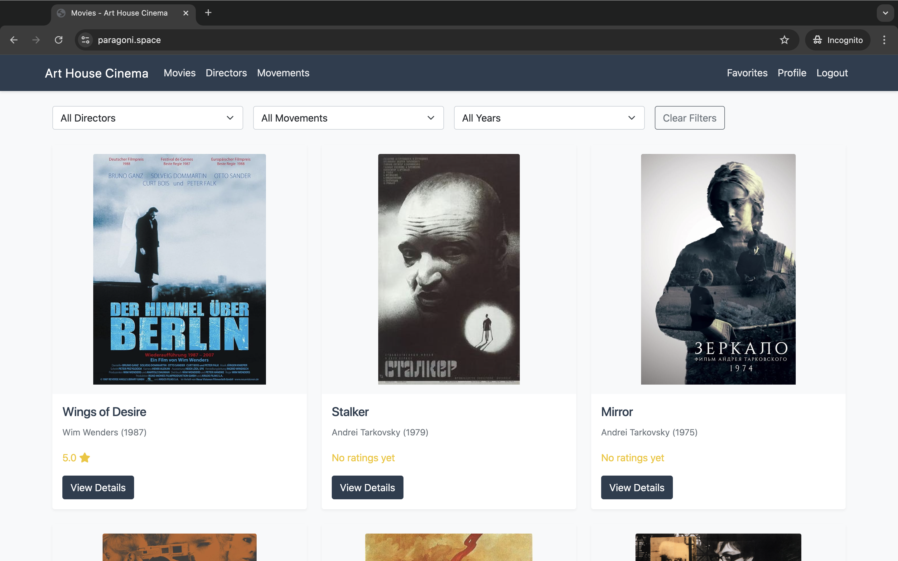
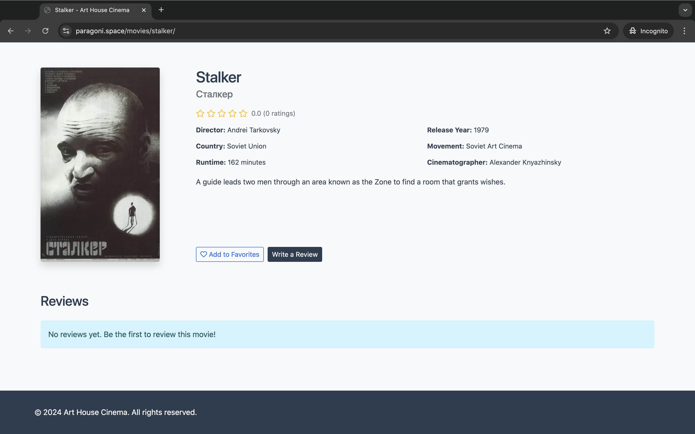
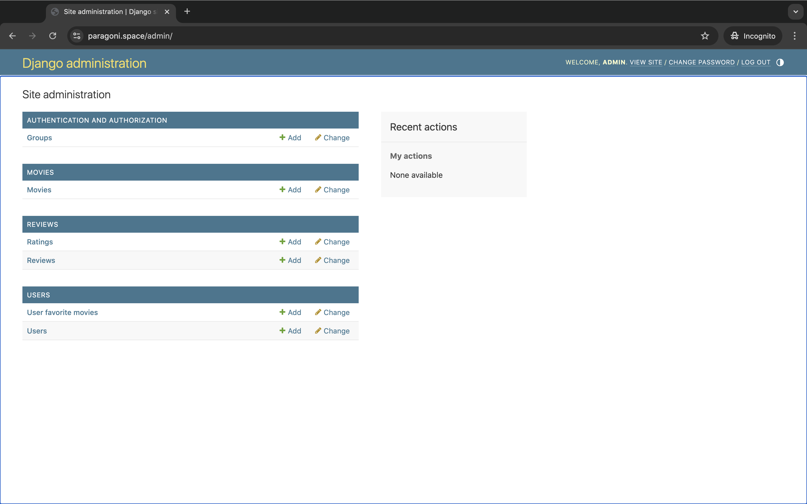

# Платформа для оценки фильмов: Обзор проекта

## Основные функции

### 1. Аутентификация и управление пользователями
- Регистрация и авторизация пользователей
- Профили пользователей с историей оценок и отзывов
- Безопасная аутентификация через JWT токены

### 2. Каталог фильмов

*Главная страница с каталогом фильмов и возможностью фильтрации*

- Подробная информация о фильмах
- Поиск и фильтрация по различным параметрам
- Категоризация по жанрам и направлениям

### 3. Детальная информация о фильмах

*Детальная страница фильма с информацией и возможностью оставить отзыв*

- Полное описание фильма
- Информация о режиссере и съемочной группе
- Система рейтингов и отзывов
- Возможность добавить фильм в избранное

### 4. Административная панель

*Административная панель для управления контентом*

- Управление пользователями и их правами
- Модерация отзывов
- Добавление и редактирование информации о фильмах

## Техническая реализация

### Архитектура кода

#### 1. Структура проекта
```
movie_rating_platform/
├── config/              # Основные настройки проекта
├── movies/             # Приложение для работы с фильмами
├── users/              # Приложение для работы с пользователями
├── reviews/            # Приложение для работы с отзывами
├── templates/          # HTML шаблоны
├── static/             # Статические файлы
└── media/             # Загружаемые файлы
```

#### 2. Модели данных

##### Movie модель
```python
class Movie(ExportModelOperationsMixin('movie'), models.Model):
    title = models.CharField(max_length=255, db_index=True)
    original_title = models.CharField(max_length=255, blank=True, default="")
    director = models.CharField(max_length=255, db_index=True)
    release_year = models.IntegerField(
        db_index=True,
        validators=[
            MinValueValidator(1888),  # Первый фильм в истории
            MaxValueValidator(timezone.now().year + 5),
        ],
    )
    description = models.TextField()
    slug = models.SlugField(unique=True, blank=True)
    average_rating = models.DecimalField(
        max_digits=3, decimal_places=2, default=0.0, db_index=True
    )
```

##### Rating система
```python
class Rating(ExportModelOperationsMixin('rating'), models.Model):
    movie = models.ForeignKey("movies.Movie", on_delete=models.CASCADE, related_name="ratings")
    user = models.ForeignKey(settings.AUTH_USER_MODEL, on_delete=models.CASCADE)
    score = models.DecimalField(
        max_digits=3,
        decimal_places=1,
        validators=[MinValueValidator(0.0), MaxValueValidator(5.0)],
    )

    def save(self, *args, **kwargs):
        super().save(*args, **kwargs)
        self.movie.update_rating()  # Автоматическое обновление рейтинга фильма
```

#### 3. API Endpoints

##### Примеры API Views
```python
class MovieViewSet(viewsets.ModelViewSet):
    queryset = Movie.objects.all()
    serializer_class = MovieSerializer
    permission_classes = [IsAuthenticatedOrReadOnly]
    filter_backends = [DjangoFilterBackend, SearchFilter, OrderingFilter]
    search_fields = ['title', 'director', 'description']
    ordering_fields = ['release_year', 'average_rating']

    @action(detail=True, methods=['post'])
    def add_to_favorites(self, request, pk=None):
        movie = self.get_object()
        UserFavoriteMovie.objects.create(user=request.user, movie=movie)
        return Response({'status': 'movie added to favorites'})
```

#### 4. Безопасность и производительность

##### JWT Аутентификация
```python
REST_FRAMEWORK = {
    'DEFAULT_AUTHENTICATION_CLASSES': [
        'rest_framework_simplejwt.authentication.JWTAuthentication',
    ],
    'DEFAULT_PERMISSION_CLASSES': [
        'rest_framework.permissions.IsAuthenticated',
    ],
    'DEFAULT_THROTTLE_CLASSES': [
        'rest_framework.throttling.AnonRateThrottle',
        'rest_framework.throttling.UserRateThrottle',
    ],
    'DEFAULT_THROTTLE_RATES': {
        'anon': '100/day',
        'user': '1000/day',
    },
}

SIMPLE_JWT = {
    'ACCESS_TOKEN_LIFETIME': timedelta(hours=1),
    'REFRESH_TOKEN_LIFETIME': timedelta(days=1),
    'ROTATE_REFRESH_TOKENS': True,
}
```

##### Оптимизация запросов
```python
class MovieListView(generics.ListAPIView):
    serializer_class = MovieSerializer
    
    def get_queryset(self):
        return Movie.objects.select_related('director')\
                          .prefetch_related('ratings')\
                          .annotate(
                              rating_count=Count('ratings'),
                              avg_rating=Avg('ratings__score')
                          )
```

### Инфраструктура

#### 1. Контейнеризация

##### Docker Compose конфигурация
```yaml
services:
  web:
    build: .
    volumes:
      - static_volume:/app/staticfiles
      - media_volume:/app/media
    depends_on:
      - db
      - redis
    environment:
      - DJANGO_SETTINGS_MODULE=config.settings

  db:
    image: postgres:13
    volumes:
      - postgres_data:/var/lib/postgresql/data

  nginx:
    build: ./nginx
    volumes:
      - static_volume:/app/staticfiles
      - media_volume:/app/media
    ports:
      - "80:80"
      - "443:443"
    depends_on:
      - web
```

#### 2. CI/CD

##### GitHub Actions Workflow
```yaml
name: CI/CD Pipeline

on:
  push:
    branches: [ main ]
  pull_request:
    branches: [ main ]

jobs:
  test:
    runs-on: ubuntu-latest
    steps:
      - uses: actions/checkout@v2
      - name: Run Tests
        run: docker-compose -f docker-compose.ci.yml run web python manage.py test

  deploy:
    needs: test
    runs-on: ubuntu-latest
    if: github.ref == 'refs/heads/main'
    steps:
      - name: Deploy to Production
        uses: appleboy/ssh-action@master
        with:
          host: ${{ secrets.SERVER_HOST }}
          username: ${{ secrets.SERVER_USER }}
          key: ${{ secrets.SSH_PRIVATE_KEY }}
          script: |
            cd movie_rating_platform
            git pull
            docker-compose up -d --build
```

#### 3. Мониторинг

##### Prometheus конфигурация
```yaml
scrape_configs:
  - job_name: 'django'
    scheme: https
    static_configs:
      - targets: ['paragoni.space']
    metrics_path: '/metrics'
    scrape_interval: 5s
    scrape_timeout: 4s
```

##### Django Prometheus интеграция
```python
INSTALLED_APPS = [
    ...
    'django_prometheus',
]

MIDDLEWARE = [
    'django_prometheus.middleware.PrometheusBeforeMiddleware',
    ...
    'django_prometheus.middleware.PrometheusAfterMiddleware',
]

DATABASES = {
    'default': {
        'ENGINE': 'django_prometheus.db.backends.postgresql',
        ...
    }
}
```

## Основные сложности и их решения

В ходе разработки проекта были успешно преодолены следующие технические вызовы:

1. **Настройка CI/CD пайплайна**
   - Интеграция GitHub Actions с удаленным сервером
   - Автоматизация развертывания с использованием Docker
   - Обеспечение безопасной передачи секретов

2. **Мониторинг и метрики**
   - Настройка Prometheus для сбора метрик Django
   - Интеграция с Grafana для визуализации
   - Отладка проблем со сбором метрик базы данных

3. **Оптимизация производительности**
   - Настройка Nginx для раздачи статических файлов
   - Оптимизация запросов к базе данных
   - Кэширование с использованием Redis

4. **Безопасность**
   - Реализация JWT аутентификации
   - Защита API endpoints
   - Безопасное хранение чувствительных данных

Эти вызовы потребовали глубокого понимания современных практик разработки, инструментов DevOps и принципов безопасности.

## Дальнейшее развитие

### Планируемые улучшения
1. Интеграция с внешними API для автоматического обновления информации о фильмах
2. Расширение системы рекомендаций
3. Добавление социальных функций (подписки, обсуждения)
4. Улучшение мобильной версии
5. Расширение аналитических возможностей

### Масштабирование
1. Оптимизация производительности для большего количества пользователей
2. Внедрение кэширования для часто запрашиваемых данных
3. Распределение нагрузки между несколькими серверами
4. Улучшение системы мониторинга и оповещений